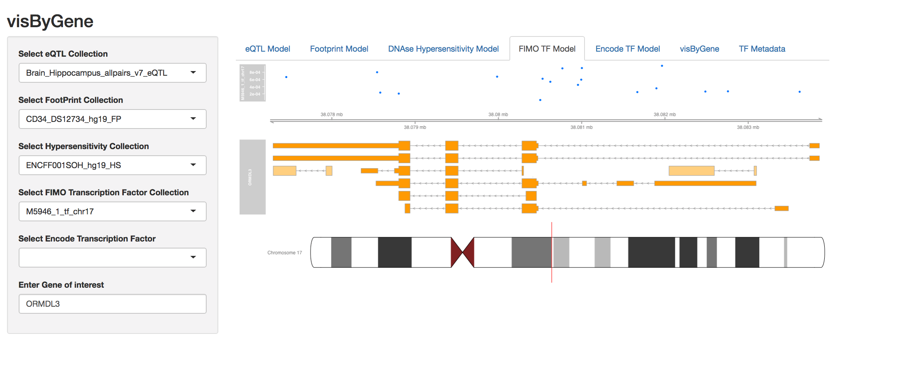

# visByGene

## To get started with our tool from within Channing Network of Network Medicine. 

The tool would soon be available to use from any network. Currently it supports mongodb running within a cluster in Channing Network alone. 

- Install "visByGene"

From Github :

- Clone the github repository
> cd visByGene/

- Fire up R

```{
  > library(devtools)
  > build(".")
  > install(".")
  > library(visBygene)
  > runvisByGene()
```





