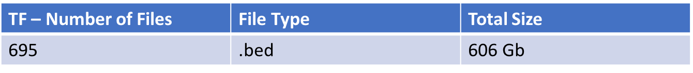
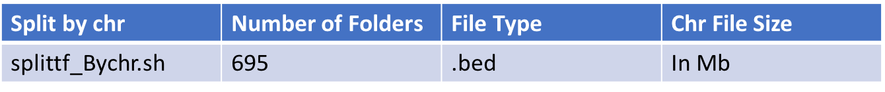

## FIMObyGene ShinyApp

- A Shiny Interface to Transcription Factor Data
 

- Data Origin :  
Kimbie's CISBP FIMO scan TF bed files: /udd/rekrg/EpiPANDA/FIMO_results/ScanBedResults - http://cisbp.ccbr.utoronto.ca/faq.html is origin of PSSM 

- Data Complexity : 

Raw Data : 

Each .bed file is split by chromosome.

## Run the APP
 
- To run the app, grab the inet IP and pass it to runFIMObyGene(ip) 
